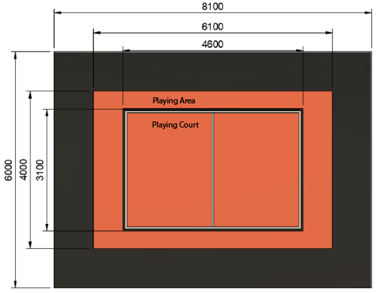

:figure-caption: Figure
:sectnums:
:stem:
:last-update-label!:

:toc:
:toclevels: 4
:toc-title: Table of contents

= Basketball Rules

== Introduction

The purpose of this competition is to imitate a real basketball game.
There are 2 robots on the court, which try to get as many balls into the opponents basket as possible.

== Court

=== General

See the general view of the basketball court – Figure 1 Court.

.Court
image::images/court_angle.jpg[width=600]

=== Measurements

The whole court has been divided into three different zones.

. Playing court is 4600 mm long and 3100 mm wide rectangular area.
Edge markings (white and black line) are included into the playing court.
. Playing area includes playing court and extra zone for robots to move around.
Playing area is 6100 mm long and 4000 mm wide.
. Competitors area is an 950 – 1000 mm wide black carpet around the playing area.

=== Court coating

==== Court coating

Playing area is coated with orange mat (ExpoRips 2007).
Surface beneath the mat is hard and even.
Competitors area is covered with a black carpet.
Competitors area is surrounded by white walls which are up to 450 mm high.
There could be sponsors logos higher than 450 mm.
Only referees, competitors and organizing team are allowed to move in the competitors area, spectators are not allowed into that area.
During the competition, everyone who moves in that area must wear clothes which do not have the same colours that are present in the playing area or baskets (except for black).

==== Court markings

For the detailed playing court, see Figure 2 Court measurements.

.Court measurements

Playing court is marked with white (colour tone is 2) and black lines.
Lines (black and white) belong to playing area.
All lines are 50 mm wide.
Court is divided into two halves with a white centerline.

== AR markers

There are two ARUCO markers on both basket boards, 160x160 mm in size with an additional 20 mm padding.
ARUCO markers have OpenCV support (instructions can be found here: http://docs.opencv.org/3.1.0/d5/dae/tutorial_aruco_detection.html).
Markers are attached to the basket board which reaches the playing court.
Exact marker position can be found in figure 5.

Markers are identified by markers ID.
On the left and right sides of the magenta coloured basket are respectively markers with ID 11 and 12.
On the left and right sides of the blue coloured basket are respectively markers with ID 21 and 22.
ARUCO markers generator can be found here: http://keystone.umd.edu/html/markergen.html.

== Baskets

Baskets are placed in the middle of the shorter edges of the court.
Basket board is in line with the black lines outer edge.
The colours of the baskets are matt blue (colour code: RAL5015) and matt magenta (colour code: RAL4010).
Courts with baskets can be seen in figures 3 and 4.

.Baskets position in top view
image::images/court_top.jpg[width=600]

.Baskets postion in side view
image::images/court_side_angle.jpg[width=600]

The basket is 500 mm high and with a 160 mm diameter, coloured and open on the top cylinder.
Attached to the basket is a basket board 660 x 800 mm.
In the bottom of the basket is a weight to keep the basket stable.
Prototype is shown in figure 5.

.Basket in front view
image::images/basket_dimensions.jpg[width=600]

== Balls

=== Dimensions and properties

A green mini squash ball is used for the competition. 
The ball is:

* green;
* weighs around 24 grams;
* 40 mm in diameter.

=== Placement of the balls

Each round starts with 11 balls on the field.
The placement of the balls is random, but symmetrical to the diagonal of the field for both players.
At least 10 different combinations of the placement of balls shall be compiled for the games.

== Number of robots and team size

Each team is allowed to have 1 robot at a time on the field during the game.
Team size is up to 6 members when signing up for the game.

== Requirements for the robot

=== General requirements

Robot is a fully autonomous machine that carries its own energy source, movement mechanisms, own management and control systems.
It is not allowed to use remote control to move the robot (only one-way connection out of the robot and sending a start signal is allowed).

=== Mechanical requirements for the robot

. During the game situation in the course of the whole competition, the robot has to fit in an upright cylinder with a diameter of 350 mm and height of 350 mm.
. Robot weight must not exceed 8 kg.
. It is not allowed for the robot to copy the following parts of the playing field:
* in the external design of the robot it is mandatory to use mostly black, white or grey colours;
* in the external design of the robot it is forbidden to use colours of the baskets or the balls.
. The robot must not intentionally segregate any parts during the game.

=== Electronic requirements for the robot

. The robot is not allowed to use LEDs during the game rounds (except by mutual agreement between the players).
Indicators and LEDs used in sensors are allowed.
. If light spreading elements are used, their intensity must not be harmful to the human eye or they should be shielded from direct observation.
. If a laser is used, the emission of the laser (averaged over 1 second) must not be more than 1 mW/mm^2^.
. The robot must not intentionally deceive the optical sensors of the opponent robot (including the camera of the robot).
. Robot must be able to independently start and stop according to the commands from the referee’s remote control.
The commands sent by the remote control and information on the required connection interface can be found in Clause 7.6
. If the robot does not start by the referee’s remote control then it is allowed to start the robot manually after 10 seconds after the round start.

=== Robot access to the competition

The robot, which does not comply with the requirements stated in clauses 7.1–7.3, is not allowed to participate in the competition.
The violation of the same requirements during the tournament will lead to total removal from the game.

=== Requirements for robot control

==== Definitions

* "Ball out of play" – is the ball that has completely passed over the black touchline when viewed from the above.

==== General

The are no direct restrictions when the robot is holding a ball; the only situation in which the goal does not count is as follows:
the robot has snapped the ball that has completely passed over the touchline of the playing court or the ball is out of play and threw it inside the basket.
It is not allowed to lift the ball into the basket.
The has to be thrown into the basket.
This means that when the ball is thrown then
the upper edge of the ball must be below 300 mm.

==== Robot penalization and disqualification

. The following list includes requirements, which result in a fault if these are violated during the game:
* the robot is not allowed to operate with more than one ball;
* the robot must not damage the field or its parts, other robots, balls, referees, the opponent team, spectators or other people surrounding the game field;
* non-malicious pushing is allowed.
It is prohibited to damage the field parts and the opponent by the confused robot;
* the robot is not allowed to leave the playing area (robot it out of court when half of the robot is out of the playing area, viewed from the top).
. The robot is given a fault, then:
* the referee stops the game and the time;
* the robots must stop;
* the robot, which got the fault must be positioned in the right corner of its playing side (check clause 8 – round arrangement);
* the opponent robot stays in the same place;
* if everything is in position then the referee starts the game again and the time will be started from the time it was stopped.
. If the robot is given a second fault, then:
* the referee stops the game and the time;
* the robots must stop;
* the robot, which got the fault will be removed from the playing area;
* the opponent robot stays in the same place;
* if everything is in position then the referee starts the game again and the time will be started from the time it was stopped.
. The faults are valid until the end of the round.
. The referee can stop the game and separate the robots from each other without issuing a fault.
In that case the time is stopped aswell.

=== Referee’s signals

==== Radio module and adjustment

. It is required for the robots to use XBee radio (product starts with a code – XB24) module that operates on Digi International 2.4 Ghz frequency.
There are many different antenna types for the module, which can be found on Digi Xbee https://www.digi.com/pdf/ds_xbeemultipointmodules.pdf[datasheet].
It is Digi Xbee model S1.
. Suitable modules can be ordered from the following providers:
* https://www.mouser.ee/ProductDetail/Digi-International/XB24-AWI-001?qs=sGAEpiMZZMtJacPDJcUJY7VcaAKGQu1gHInEUFlTTaA%3D[Mouser]
* http://uk.farnell.com/digi-international/xb24-awi-001/rf-module-txrx-xbee-wire-ant/dp/1337912[Farnell]
. Radio modules can be adjusted with AT commands.
For that it is possible to use a program XCTU, which can be used to configure the XBee module.
Information about the XCTU program and download link can be found https://www.digi.com/products/xbee-rf-solutions/xctu-software/xctu[here].
. Radio module settings:
* Baud: can be chosen accordingly to your own system, does not interfere with modules communicating with each other.
* Node ID: "According to the requirements of Clause 7.6.2. (Must be convertible during the competition)"

//-

* The rest of the settings that are not separately highlighted should be left with the factory settings.
In case any changes are made in the radio equipment, the head referee will immediately inform all participants.

==== Commands from the referee’s remote control and responding to them

The remote control uses LLAP protocol, developed by Ciseco, to send messages.

Protocols overall description:

* Every package includes 12 characters ( char);
* 1 start-bait;
* 2 baits about device ID;
* 9 data-baits;
* Missing chars are filled with dashes '-'.

Tabel 1 Description of commands

[]
|===
3+|*Command* 3+|*Description*
|*Start* |*ID* |*Data* |*Field* |*Signal* |*Robot(s)*
|`a` |`AX` |`START----` |A |START |All
|`a` |`AX` |`STOP-----` |A |STOP |All
|`a` |`AA` |`START----` |A |START |A
|`a` |`AB` |`START----` |A |START |B
|`a` |`AC` |`START----` |A |START |C
|`a` |`AD` |`START----` |A |START |D
|`a` |`AA` |`STOP-----` |A |STOP |A
|`a` |`AB` |`STOP-----` |A |STOP |B
|`a` |`AC` |`STOP-----` |A |STOP |C
|`a` |`AD` |`STOP-----` |A |STOP |D
|`a` |`BX` |`START----` |B |START |All
|`a` |`BX` |`STOP-----` |B |STOP |All
|`a` |`BA` |`START----` |B |START |A
|`a` |`BB` |`START----` |B |START |B
|`a` |`BC` |`START----` |B |START |C
|`a` |`BD` |`START----` |B |START |D
|`a` |`BA` |`STOP-----` |B |STOP |A
|`a` |`BB` |`STOP-----` |B |STOP |B
|`a` |`BC` |`STOP-----` |B |STOP |C
|`a` |`BD` |`STOP-----` |B |STOP |D
|===

For example, the command aBCSTART---- activates robot C on field B, the command aABPING----- asks about the readiness of robot B on field A.

The robot must respond to all commands that are sent to this specific robot:

* aXXACK-----

In the response, XX must be replaced with the ID of the responding robot.
The robot has to answer using ACK signal during 40 ms from receiving the data packet (about 50 ms from start of the transmission).
ACK may not answer commands given to all the robots at the same time.

To ensure the activation of the robots, the referee’s remote issues a PING command to both robots alternately before the start, which also needs to be responded to using ACK signal.
This allows the referee to see if the robots are ready (i.e. if the signal reaches them).
The start and stop signal meant for the whole field is sent in 10 packets in 10 ms intervals.

==== Referee’s remote control

.referee’s remote control
image::images/ref_remote.jpg[width=400]

Technical description of the remote control:

* The remote control contains XB24-AWI-001 module;
* the drive of the remote control is AVR microcontroller;
* the remote control is powered by two AAA batteries.

User interface of the remote control:

* on/off switch;
* four big buttons (RGB Led under each);
* mode switch of the remote control.

== Referees

Each game is coordinated by the head referee, ensures the compliance of the competition and games to the competition rules.
The head referee is assisted by two basket referees, each for one basket.

=== Head referee

The tasks of the head referee include:

* Carries out the technical inspection of the robots and decides which ones will be allowed to compete (see clause 13).
* Ensures that the balls and their placement during the competitions comply with the competition rules (see clause 5).
* Starts, stops, and ends the game.
* Informs the players and goal referees about the beginning and end of the round (see clause 11)
* Gives the order to the team to remove robot from the game until the end of the round if any of the requirements given in clause 7.5 are violated
* Ends the game round if both robots have violated the requirements given in clause 7.5.
* May pick the balls out of play during the game provided that none of the robots does operate with the ball at the moment.
* If necessary, can stop or end the game if there appears to be any external disruptive factors.
* May remove misbehaving team members from the playing field.
* Ensures that the spectators do not enter the competitors’ area (see Court coating).
* Delivers the game result and other relevant information that may influence the game result to the game organisers after the game.

The head referee’s decisions related to the game and rounds are final.
The head referee has the right to change his or her decision if any relevant additional information occurs.

== Competition arrangement

There are two different tournament systems used at the same time.
Firstly, the competition is being done by Swiss-system tournament rules until 4 best competitors will arise.
By Swiss-system tournament, in the first round the opponent is chosen randomly.
Every other round has robots competing whose results are the same or closest.
If there are uneven number of competitors there is a possibility to get a "bye", which means automatic victory.
None of the robots will compete against each other twice and no robot gets two "byes" 

After that there will be a double-elimination tournament between the 4 best competitors.
This will reveal the final ranking.

== Game arrangement

One game lasts for 3 main rounds (in exceptional cases up to 2 rounds, if both rounds are won by one robot) and if it is necessary then also 3 extra rounds and free throw round(s) will be conducted.
The winner robot is the one which has more main round wins.
If the main rounds end with a draw then the winner will be the robot which wins the first extra round and when extra rounds end with a draw again, then free throw round(s).

=== Free throw arrangement

There are 3 to 10 free throw rounds.
Robots must shoot free throws alternately and the round is won by a robot that scores more baskets.
During free throws, only one basket is used and it will be chosen by the referee with a coin toss.
1 ball is on the court during the free throws that is placed 1300 mm away from the basket on imagery line between the basket and the center line.
Robot starts the free throw round from the center line.
One free throw round lasts for 10 seconds.
The round starts with a referees signal.
Round ends if the throw has been made or the referee has stopped the round.
The winner of free throw rounds is robot which has scored more baskets compared to the other robot.
If first three rounds end with a draw then free throws will be made until one robot wins.
If free throw rounds end with a draw then another set of free throws will be arranged, until one robot wins.

.free throw distance
image::images/free_throw_distance.png[width=400]

== Round arrangement

One main round lasts for 60 seconds.
Extra round lasts for 30 seconds.
In the beginning of each round, both robots are positioned in the right corner of their side of the court.
The robots must touch playing courts end line and side line which are black in colour.
The round begins and ends with head referee’s signal.
After the round, both robots are stopped.
If a fault is made then the time will be stopped by the referee.

== Scoring

The points are counted at the end of the round.
Each ball that is fully in the basket gives one point.
The balls that have bounced back from the basket board, the basket itself or another robot and stay in the playing court can be still played with.
The balls that are not inside the playing court must not be used to play with.
The winner of the round is the team who has more points at the end of the round.

== Technical inspection

Technical inspection is carried out in the morning of the competition day.
During the technical inspection, the head referee inspects if the robot meets the requirements (see clause 7) and tests the competitive capability.
In order to show the capability, the attacking robot has to score at least 1 ball out of 5 balls during 60 seconds, while being alone in the field.
Non-compliant robots and robots incapable of fighting are not allowed to participate in the competition.

== Registration

Registration form is opened at least a month before the competition.

== Organization

. The robot must be registered before the competition.
The registration process includes technical inspection of the robot and marking the robot with a number sticker.
. Technical inspection must be completed by the time that is specified by the organisers.
. All questions and problems arising during the competition are solved by the referee.
. The final decision regarding any appeals is made by the referee and/or the organizers.
All complaints must be reported to the referee during the match or right after the ending of the match.
Complaints filed later will not be accepted.
The final decision regarding any disputes or inconsistencies, is always made by the referee.
