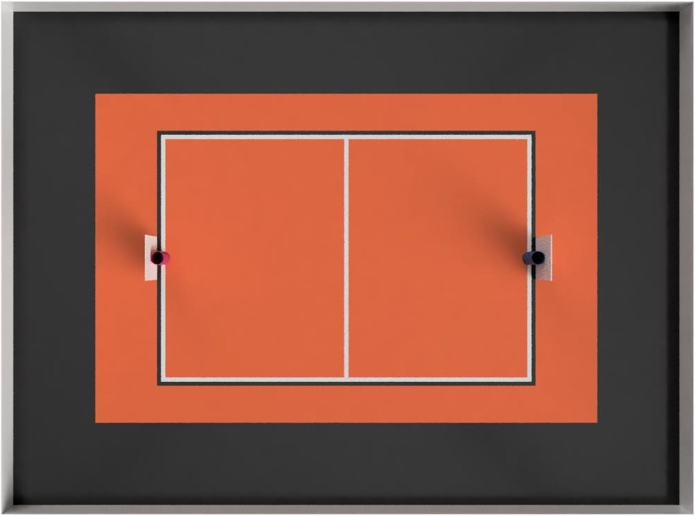

:figure-caption: Figure
:table-caption: Table
:sectnums:
:stem:
:last-update-label!:
:xrefstyle: short
:section-refsig:

:toc:
:toclevels: 4
:toc-title: Table of contents

= Basketball Rules

== Introduction

The purpose of this competition is to imitate a real basketball game.
There are 2 robots on the court, which try to get as many balls into the opponent's basket as possible.

== Court

=== General

General view of the basketball court is shown in <<image_court_angle>>.

[#image_court_angle]
.Court
image::images/court_angle.jpg[width=600]

=== Dimensions

The court is divided into three different zones.

. Playing court is 4600 mm long and 3100 mm wide rectangular area.
Edge markings (white and black lines) are part of the playing court.
. Playing area includes playing court and extra zone for robots to move around.
Playing area is 6100 mm long and 4000 mm wide.
. Competitors area is an 950 – 1000 mm wide black carpet around the playing area.

[#court_surface]
=== Court surface

The surface of the playing area is orange needle felt carpet (ExpoRips 2007).
Surface beneath the carpet is hard and even.
Competitors area is covered with a black carpet.
Competitors area is surrounded by white walls which are at least 450 mm high.
There can be sponsor logos on the walls if the logos are higher than 450 mm.
Only referees, competitors of the current game and organising team are allowed to move in the competitors area, spectators are not allowed into that area.
During the competition, everyone in that area must wear clothes which do not have the same colours that are present in the playing area or baskets (except for black).

==== Court markings

Court dimensions are shown in <<image_court_dimensions>>.

[#image_court_dimensions]
.Court dimensions
image::images/court_dimensions_eng.png[width=600]

Playing court is marked with white and black lines.
Lines (black and white) are part of the playing court.
All lines are 50 mm wide.
Court is divided into two halves with a white centerline.

== AR markers

There are two 160 x 160 mm ARUCO markers on both backboards.
Markers are attached to the bottom corners of the backboard.
Exact marker positions and dimensions can be found in <<image_basket_dimensions>>.

Markers are identified by marker's ID:

* *11* on the *left* of the *magenta* basket
* *12* on the *right* of the *magenta* basket
* *21* on the *left* of the *blue* basket
* *22* on the *right* of the *blue* basket

ARUCO marker generator can be found here: http://chev.me/arucogen/.

== Baskets

Baskets are placed in the middle of the endlines (shorter edges) on the court.
Backboard's side with the basket is in line with the black line's outer edge.
The colours of the baskets are matt blue (colour code: RAL5015) and matt magenta (colour code: RAL4010).
Court with baskets can be seen in <<image_court_top>> and <<image_court_side_angle>>.

[#image_court_top]
.Baskets positions in top view

[#image_court_side_angle]
.Baskets positions in side view
image::images/court_side_angle.jpg[width=600]

Basket is a painted pipe with following dimensions:

* height 500 mm
* outside diameter 160 mm
* inside diameter 148 mm

Attached to the basket is a white backboard with dimensions of 660 x 800 mm.
Basket dimension can be seen in <<image_basket_dimensions>>.

[#image_basket_dimensions]
.Basket in front view
image::images/basket_dimensions.jpg[width=600]

[#balls]
== Balls

=== Dimensions and properties

Balls are green mini squash balls with a mass of around 24 grams and a diameter of around 40 mm.

=== Placement of the balls

Each round starts with 11 balls on the court.
The placement of the balls is random, but symmetrical for both robots with respect to the diagonal of the court.
At least 10 different ball placement combinations must be prepared for the games.

== Number of robots and team size

2 robots are on the court during the game, 1 per each team.
Up to 6 members can be registered to a team.

[#robot_requirements]
== Requirements for the robot

[#robot_requirements_general]
=== General requirements
:xrefstyle: basic

Robot is a fully autonomous machine that carries its own energy source, movement mechanisms, management and control systems.
It is not allowed to use remote control to move the robot during a game.
Only one-way communication out of the robot and sending a start signal is allowed.
Robot is not allowed to send anything else than ACK signal in response to referee's signal through radio module (see <<referee_signals>>).

[#robot_requirements_mechanical]
=== Mechanical requirements for the robot

. Robot has to fit in an upright cylinder with a diameter of 350 mm and height of 350 mm the entire time during the game.
. Robot's mass must not exceed 8 kg.
. Majority of robot's external design must consist of black, white or gray colours.
It is not allowed to use ball and basket colours in the external design.
. The robot is not allowed to intentionally detach any parts during the game onto the court.

[#robot_requirements_electrical]
=== Electronic requirements for the robot
:xrefstyle: short

. The robot is not allowed to use LEDs during the game rounds (except by mutual agreement between the opposing teams).
Indicators and LEDs used in sensors are allowed if the LEDs do not violate the external design requirements (see <<robot_requirements_mechanical>>).
. If light spreading elements are used, their intensity must not be harmful to the human eye or they should be shielded from direct observation.
. If a laser is used, the emission of the laser (averaged over 1 second) must not be more than 1 mW/mm^2^.
. The robot must not intentionally deceive the optical sensors of the opponent robot (including the camera of the robot).
. Robot must be able to independently start and stop according to the commands from the referee's remote control.
The commands sent by the remote control and information on the required connection interface can be found in <<referee_signals>>
. Robot is allowed to be started manually after 10 seconds of the start of the round.

=== Robot access to the competition
:xrefstyle: short

The robot, which does not comply with the requirements stated in sections <<robot_requirements_general>> - <<robot_requirements_electrical>>, is not allowed to participate in the competition.
Violating these requirements during the tournament will lead to removal from the competition.

[#robot_control_requirements]
=== Requirements for robot control

==== Definitions

. Ball out of play – ball that has at least once completely passed over the black line when viewed from the top.

==== General

The are no direct restrictions for operating a ball.
Basket is not counted when a ball that is out of play is thrown in the basket.

==== Robot penalisation and disqualification
:xrefstyle: basic

. Robot receives a fault when the robot:
* holds more than one ball at a time;
* moves a basket:
* damages the court or its parts, other robots, balls, referees, the opponent's team, spectators or other people surrounding the court.
Non-malicious pushing is allowed.
It is not allowed to damage the court and the opponent by the confused robot;
* leaves the playing area (over half of the robot is out of the playing area, viewed from the top).

. On first fault:
* the referee stops the game and the time;
* the robots must stop;
* the robot, which received the fault, *must be moved to the starting position* (see <<game_round>>);
* the opponent robot stays in the same place;
* referee will resume the game and the game's time will continue from where it was stopped.

. On second fault:
* the referee stops the game and the time;
* the robots must stop;
* the robot, which received the fault, *must be removed from the playing area*;
* the opponent robot stays in the same place;
* referee will resume the game and the game's time will continue from where it was stopped.

. The faults are valid until the end of the round.

. The referee can stop the game and separate the robots from each other without issuing a fault.
In that case the time is stopped as well.

[#referee_signals]
=== Referee’s signals

==== Radio module and configuration

. Robots must use XBee 802.15.4 radio module (S1, S2C or XBee3) from Digi International.
. S1 radio modules do not need to be configured.
S2C and XBee3 modules must be flashed with 802.15.4 firmware.
Settings can be changed, but it should be taken into account that referee's remote uses default settings in 802.15.4 firmware.
Modules can be configured with AT commands.
https://www.digi.com/products/embedded-systems/digi-xbee/digi-xbee-tools/xctu[XCTU] can be used to change the settings.

==== Commands from the referee’s remote and responding to them

The remote sends commands in the following format:

* Every command is 12 bytes long.
** 1 start byte: `a` (`0x61`, `97`)
** 1 court ID byte in the range of `A` - `W` (`0x41` - `0x57`, `65` - `87`)
** 1 robot ID byte in the range of `A` - `W` (`0x41` - `0x57`, `65` - `87`)
** 9 data bytes
* Missing bytes are filled with hyphens: `-` (`0x2d`, `45`).
* Commands where robot ID is `X` (`0x58`, `88`) are meant for all of the robots.

.Description of commands
[]
|===
4+|*Command* 3+|*Description*
|*Start* |*Court ID* |*Robot ID* |*Data* |*Court* |*Signal* |*Robot(s)*
|`a` |`A` - `W` |`X` |`START----` |A - W |START |All
|`a` |`A` - `W` |`X` |`STOP-----` |A - W |STOP |All
|`a` |`A` - `W` |`A` - `W` |`START----` |A - W |START |A - W
|`a` |`A` - `W` |`A` - `W` |`STOP-----` |A - W |STOP |A - W
|`a` |`A` - `W` |`A` - `W` |`PING-----` |A - W |PING |A - W
|===

For example, the command `aBCSTART----` activates robot C on court B and the command `aABPING-----` asks about the readiness of robot B on court A.

The robot must respond to all commands that are sent to this specific robot with: `aXXACK------`

In the response, the first `X` must be replaced with the court ID and the second `X` with the ID of the responding robot.
The robot has to answer using ACK signal in 40 ms from receiving the command.
It is not allowed to respond to commands that are sent to all of the robots.
To ensure that the robots are able to receive the commands, PING commands might be sent to both robots before the game.
The start and stop signal meant for the whole court is sent 3 times in 100 ms intervals.
Other signals are sent once at the time.

Every court will have an unique ID, which does not change during the competition.
Robot that starts the first round of a game on the magenta side (throwing into blue basket) has ID of `A`.
Opposing robot has ID of `B`.
Robots IDs will not change during the game.
Robots must be able to receive and respond to commands with different IDs based on the court and starting position.

==== Referee's remote control

Remote control consists of:

* XBee 802.15.4 radio module
* XBee USB adapter
* Computer with referee's remote software:
** https://github.com/ut-robotics/robot-basketball-ref

== Referees

Each game is coordinated by the head referee, who ensures the compliance of the competition and games to the competition rules.
The head referee is assisted by 2 basket referees, each for one basket and 1 referee sending signals with referee's remote.

=== Head referee
:xrefstyle: basic

The tasks of the head referee include:

* Carries out the technical inspection of the robots and decides which ones will be allowed to compete (see <<qualification>>).
* Ensures that the balls and their placement during the competitions complies with the competition rules (see <<balls>>).
* Starts, stops, and ends the game.
* Informs the players and assistant referees about the beginning and end of the round (see <<game_round>>).
* Gives the order to the team to remove robot from the game until the end of the round if any of the requirements given in <<robot_control_requirements>> are violated.
* Ends the game round if both robots have violated the requirements given in <<robot_control_requirements>>.
* May remove the balls that are out of play during the game provided that none of the robots is operating with the ball at the moment.
* If necessary, can stop or end the game if there appears to be any external disruptive factors.
* May remove misbehaving team members from the competitors area.
* Ensures that the spectators do not enter the competitors area (see <<court_surface>>).
* Delivers the game result and other relevant information, that may influence the game result, to the competition organisers after the game.

The head referee's decisions related to the game and rounds are final.
The head referee has the right to change his or her decision if any relevant additional information occurs.

== Competition arrangement

There are two different tournament systems used.
Competition starts with Swiss-system tournament to determine 4 best robots.
By Swiss-system tournament rules, in the first round of games, the robots are matched randomly.
Other rounds of games will match the robots with the closest standings.
If there are odd number of competitors, then one of the robots in each round of games gets a bye, which means automatic victory.
None of the robots will compete against each other twice and no robot gets two byes. 

Minimum number of Swiss-system tournament rounds is asciimath:[ceil(log_2 n_(rob\ot))]:

* 1 - 4 robots do not need to play any Swiss-system games.
* 5 - 8 robots will play 3 rounds.
* 9 - 16 robots will play 4 rounds.
* 17 - 32 robots will play 5 rounds.

After that there will be a double-elimination tournament between the 4 best robots.
This will reveal the final ranking.

== Game arrangement

One game consists of 3 or 2 (if both rounds are won by one robot) main rounds and if necessary then also 3 extra rounds and free throw rounds.
The game is won by having more main round wins.
If the main rounds end with a draw, then the robot that is the first to win an extra round, wins the game.
If extra rounds end with a draw, then the winner will be determined with free throws.
Swiss-system games can end with a draw and no extra rounds or free throws will be played.

Robots have to change sides after every round.
Sides must be changed in 2 minutes.

[#game_round]
== Round arrangement

One main round lasts for 60 seconds.
Extra round lasts for 30 seconds.
In the beginning of each round, both robots are positioned in the right corner (viewed from the back of the basket) of their side of the court.
The robots must touch the point where the black endline and black sideline meet.
The round begins and ends with head referee's signal.
At the end of the round, both robots must stop.
If a fault is made then the time will be stopped.

== Scoring

The points are counted at the end of the round.
Each ball that is fully in the basket gives one point.
The balls that are out of play are not counted.
Round is won by having more points.

== Free throw arrangement
:xrefstyle: short

At least 3 free throw rounds must be played.
Both robots must perform a one free throw in each round.
Only one basket is used and it will be chosen with a coin toss by the referee.
Only 1 ball is on the court and it is placed 1300 mm away from the basket on the same line with both of the baskets (see <<image_free_throw_distance>>).
The winner of free throw rounds is the robot which has scored more baskets.
If first three rounds end with a draw then additional rounds will be played until a round is won by a robot.

Free throw procedure:

. Robot starts the free throw from the center of the court.
. Robot has 10 seconds to throw.
. Free throw starts with referee's signal.
. Free throw ends if the throw has been made or the referee has stopped the round.

[#image_free_throw_distance]
.Ball distance before free throw
image::images/free_throw_distance.png[width=400]

[#qualification]
== Technical inspection
:xrefstyle: basic

Technical inspection is carried out in the morning of the competition day.
During the technical inspection, the head referee inspects if the robot meets the requirements (see <<robot_requirements>>) and tests the capability to compete.
In order to show the capability to compete, the robot has to score at least 1 ball out of 5 balls in 60 seconds, while being alone in the court.
Non-compliant robots and robots incapable to compete are not allowed to participate in the competition.

== Registration

Registration form is opened at least a month before the competition.

== Organisation

. The robot must be registered before the competition.
The registration process includes technical inspection of the robot and marking the robot with a number.
. Technical inspection must be completed by the time that is specified by the organisers.
. All questions and problems arising during the competition are solved by the referee.
. All complaints must be reported before the start of the next game.
. The final decision regarding any disputes or inconsistencies is always made by the referee or the organisers.
