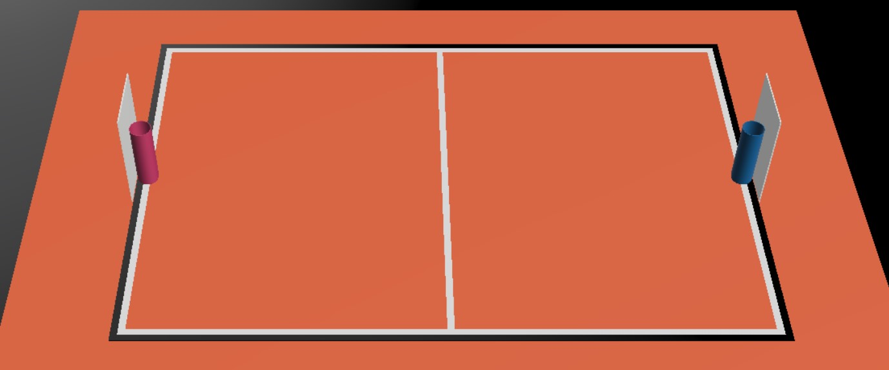
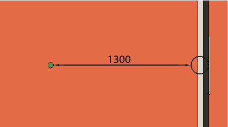

:figure-caption: Joonis
:sectnums:
:stem:
:last-update-label!:

:toc:
:toclevels: 4
:toc-title: Sisukord

= Korvpalli Reeglid

== Tutvustus

Võistluse eesmärk on jäljendada korvpalli võistlust.
Väljakul on korraga 2 robotit, kelle eesmärgiks on teatud aja jooksul saada võimalikult palju palle vastase korvi.

== Väljak

=== Üldine

Võistlusväljaku üldist plaani vaata _Joonis 1 Väljak ruumiliselt_.

.Väljak ruumiliselt.

=== Mõõtmed

Kogu väljak on jagatud kolmeks erinevaks tsooniks.

. Võistlusala on ristkülikukujuline, pikkusega 4600 mm ja laiusega 3100 mm.
Ääremärgistus (valge joon + must joon) kuulub võistlusala sisse.
. Mänguala sisaldab võistlusala ja lisatsooni robotitele liikumiseks.
Ala pikkus on 6100 mm ja laius 4000 mm.
. Võistlejateala on 950 - 1000 mm laiune musta värvi vaip mänguala ümber.

=== Väljaku kate

==== Väljaku kate

Väljaku mänguala katteks on oranž viltmatt (ExpoRips 2007).
Vaibaalune pind on ühtlane ja kõva.
Väljaku võistlejateala on must vaip.
Võistlejateala välispiiril ehk väljaku kattest 950 - 1000 mm kaugusel on vähemalt 450 mm kõrgused valged seinad.
Kõrgemal osal võivad asuda võistluse sponsorite logod.
Võistlejatealal tohivad liikuda ainult korraldav võistkond, kohtunikud ja toimuva mängu võistlejad, pealtvaatajatele on seal liikumine keelatud.
Võistluse ajal vastava alal liikujate riietuses ei tohi olla väljaku ega korvide värve (v.a must).

==== Võistlusala märgistus

Detailset võistlusala vaata _Joonis 2 Väljaku mõõtmed_.

.Väljaku mõõtmed

Võistlusala on märgistatud valgete (värvi toon 2) joontega ning lisaks ka musta joonega võistlusala välimises servas.
Jooned (must ja valge) kuuluvad võistlusala juurde.
Kõik jooned on 50 mm laiused.
Väljak on keskjoonega jagatud kaheks pooleks.

== AR markerid

Mõlema korvilaua külge on kinnitatud kaks ARUCO markerit, mis on mõõtmetelt 160x160 mm ning millele lisandub 20mm padding.
ARUCO markeritel on olemas OpenCV tugi (Juhend on leitav - http://docs.opencv.org/3.1.0/d5/dae/tutorial_aruco_detection.html).
Markerid on kinnitatud korvilaua külge, mis ulatub võistlusväljakuni.
Markerite täpne asetus koos mõõtmetega on leitav jooniselt 5.

Markerid on tuvastatavad markerite ID järgi.
Magenta värvi korvi vasakul ja paremal pool on markerid ID-ga vastavalt 11 ja 12 ning sinist värvi korvi vasakul ja paremal pool on markerid ID-ga vastavalt 21 ja 22.
ARUCO markerite generaator on leitav: http://keystone.umd.edu/html/markergen.html

== Korvid

Korvid on paigutatud väljaku lühemate servade keskele väljakuga samale tasapinnale.
Korvilaua korvipoolne sein on kohakuti musta joone välimise servaga.
Väljakul on üks korv märgistatud sinise (värvikood: RAL5015) ning teine korv magenta (värvikood: RAL4010) mattvärviga.
Väljakuid on võimalik näha joonistel 3 ja 4.

.Korvide asetus pealtvaates
image::images/court_top.jpg[width=600]

.Korvide asetus külgvaates

Korv on 500 mm kõrge ning 160 mm diameetriga värviline pealt avatud silinder.
Korvi küljes on maani ulatuv põrkelaud mõõtmetega 660x800 mm.
Silindri põhjas on raskus tagamaks stabiilsust.
Prototüüpi on näha joonisel 5.

.Korv eestvaates

== Pallid

=== Mõõdud ja omadused

Pall on roheline mini squashi pall. See on:

* rohelist värvi;
* massiga ligikaudu 24 g;
* diameetriga ligikaudu 40 mm.

=== Pallide asetus

Iga vooru alguses on väljakul 11 palli.
Pallide asetus on juhuslik, aga mõlema mängija jaoks sümmeetriline väljaku diagonaali suhtes.
Mängude jaoks koostatakse vähemalt 10 erinevat pallide paiknemise kombinatsiooni.

== Robotite arv ja võistkonna suurus

Mängu jooksul on väljakul korraga võistlemas 2 robotit, 1 robot kummagi võistkonna kohta.
Võistkonna suurus registreerimisel on kuni 6 liiget.

== Robotile esitatavad nõuded

=== Üldised nõuded

Robot on täielikult autonoomne masin, mis kannab oma energiaallikat, liikumismehhanisme ja oma juhtimis- ning kontrollsüsteeme.
Robotit ei tohi võistluse ajal kaugjuhtida (lubatud on ühesuunaline side robotist välja ja stardimärguande saatmine).

=== Roboti mehaanilised nõuded

. Robot peab mahtuma terve võistluse jooksul mängusituatsioonis püstisesse silindrisse, mille diameeter on 350 mm ja kõrgus on 350 mm.
. Roboti mass ei tohi olla suurem kui 8 kg.
. Robot ei tohi jäljendada järgmisi väljaku osasid:
* roboti väliskujunduses peab kasutama suuremas osas musta, valget või halli värvi
* robot ei tohi sisaldada endas pallide ega korvide värve
. Robot ei tohi võistluse ajal väljakule tahtlikult enda küljest osasid eraldada.

=== Roboti elektroonilised nõuded

. Võistlusvoorude ajal ei tohi robot kasutada LED-e (välja arvatud võistlejate vastastikusel nõusolekul).
Indikaatorid ja andurites kasutatavad LED-id on lubatud.
. Juhul kui kasutatakse valgust levitavaid elemente, siis ei tohi nende intensiivsus olla inimese silmale ohtlik või peab olema varjestatud otsevaatluse eest.
. Juhul kui kasutatakse laserit, siis ei tohi laseri poolt kiiratud kiirgus (keskmistatud üle 1 sekundi) olla suurem kui 1 mW/mm^2^.
. Robot ei tohi tahtlikult petta vastasroboti optilisi andureid (sealhulgas ka roboti kaamerat).
. Robot peab suutma startida ja peatuda iseseisvalt kohtuniku juhtpuldi käskude peale.
Juhtpuldi poolt saadetavad käsud ja info nõutud ühendusliidese kohta leiab punktist 7.6.
. Juhul, kui robot 10 sekundi jooksul ei käivitu, on lubatud see käivitada manuaalselt.

=== Roboti pääs võistlusele

Robot, mis ei vasta punktides 7.1 - 7.3 nimetatud nõuetele, ei pääse võistlusele.
Samade nõuete vastu eksimine turniiri käigus toob kaasa roboti kõrvaldamise kogu turniirilt.

=== Roboti juhtimise nõuded

==== Mõisted

. Audis pall - on võistlusala piiravast mustast joonest pealtvaates 100% väljaspool käinud pall.

==== Üldine

Palli käsitlemisel roboti poolt otseseid piiranguid ei ole.
Olukord, mille korral korvi ei loeta, on järgmine: robot on haaranud võistlusalast täielikult väljunud ehk audis palli ja visanud selle korvi.
Palli ei tohi korvi tõsta, pall peab olema korvi visatud.
Viskamine tähendab, et palli õhku paiskamisel peab palli ülemine serv olema madalamal kui 300mm.

==== Roboti karistamine ja eemaldamine

. Järgnevalt on toodud nõuded, mille vastu mängu ajal eksimise korral määratakse robotile viga:
* robot ei tohi korraga opereerida rohkem kui ühe palliga;
* robot ei tohi füüsiliselt liigutada korvi;
* robot ei tohi kahjustada väljakut ega selle osasid, teisi roboteid, palle, kohtunikke, vastasvõistkonda, pealtvaatajaid ega teisi võistlusväljakut ümbritsevaid inimesi;
* lubatud on mittepahatahtlik nügimine. 
Väljaku osade ja vastase kahjustamine segadusse sattunud roboti poolt on keelatud;
* robot ei tohi väljakult lahkuda (robot loetakse välja sõitnuks, kui üle poole roboti kerest on pealtvaates väljaku kattelt maha sõitnud).
. Kui robotile määratakse viga siis:
* kohtunik peatab mängu ning ajavõtt peatatakse;
* robotid peavad peatuma;
* karistuse saanud robot tuleb paigutada oma väljakupoole paremasse nurka stardipositsioonile (vt punkti 8 Vooru korraldus);
* vastasrobot jääb samale asukohale;
* kohtunik jätkab mängu ning aja võtmine jätkub.
. Kui robotile määratakse teine viga, siis:
* kohtunik peatab mängu ning ajavõtt peatatakse;
* robotid peavad peatuma;
* karistuse saanud robot tuleb eemaldada väljakult;
* vastasrobot jääb samale asukohale;
* kohtunik jätkab mängu ning aja võtmine jätkub.
. Vead kehtivad vooru lõpuni.
. Kohtunikul on lubatud mäng peatada ja robotid lahutada ka ilma viga andmata. 
Sel juhul peatatakse ka ajavõtt.

=== Kohtuniku signaalid

==== Raadiomoodul ja seadistamine

. Robotitel on nõutud kasutada Digi Internationali 2.4 Ghz sagedusel töötavat XBee raadiomoodulit toote nime algusega XB24.
Moodulitele pakutakse erinevaid antennitüüpe, mis on täpsustatud Digi XBee https://www.digi.com/pdf/ds_xbeemultipointmodules.pdf[datasheetil].
Tegemist on Digi XBee S1 mooduliga.
. Sobivaid mooduleid on võimalik tellida järgnevatelt pakkujatelt
* https://www.mouser.ee/ProductDetail/Digi-International/XB24-AWI-001?qs=sGAEpiMZZMtJacPDJcUJY7VcaAKGQu1gHInEUFlTTaA%3D[Mouser]
* http://uk.farnell.com/digi-international/xb24-awi-001/rf-module-txrx-xbee-wire-ant/dp/1337912[Farnell]
. Raadiomooduleid saab seadistada AT käskudega.
Selleks on võimalik kasutada XBee moodulite seadistamiseks ettenähtud programmi XCTU, mille kohta leiab informatsiooni ja allalaadimise linke https://www.digi.com/products/xbee-rf-solutions/xctu-software/xctu[siit].
. Raadiomooduli seaded:
* Baud: valitav vastavalt enda süsteemile, ei mängi rolli moodulite omavahelisel suhtlemisel
* Node ID: "vastavalt punkti 7.6.2 nõutele. (Peab olema võistluse ajal muudetav)"
. Kõik ülejäänud seaded, mida ei ole eraldi välja toodud, tuleb jätta tehase seadetele vastavaks.
Oluliste raadio seadete muutumise korral annab peakohtunik sellest viivitamatult kõigile osalistele teada.

==== Kohtuniku puldi saadetavad käsud ja neile vastamine

Juhtpult kasutab sõnumite saatmiseks Ciseco poolt välja arendatud LLAP protokolli.

Protokolli üldine kirjeldus:

* Iga pakett sisaldab 12 tähemärki ( char );
* 1 start-bait;
* 2 baiti seadme ID kohta;
* 9 data-baiti;
* Puuduolevad charid täidetakse kriipsudega '-'.

Tabel 1 Käskude kirjeldused

[]
|===
3+|*Käsk* 3+|*Kirjeldus*
|*Start* |*ID* |*Data* |*Väljak* |*Signaal* |*Robot(id)*
|`a` |`AX` |`START----` |A |START |Kõik
|`a` |`AX` |`STOP-----` |A |STOP |Kõik
|`a` |`An` |`START----` |A |START |n- A,B,C,D (Roboti tähis)
|`a` |`An` |`PING-----` |A |PING |n- A,B,C,D (Roboti tähis)
|`a` |`BX` |`START----` |B |START |Kõik
|`a` |`BX` |`STOP-----` |B |STOP |Kõik
|`a` |`Bn` |`START----` |B |START |n- A,B,C,D (Roboti tähis)
|`a` |`Bn` |`STOP-----` |B |STOP |n- A,B,C,D (Roboti tähis)
|`a` |`Bn` |`PING-----` |B |PING |n- A,B,C,D (Roboti tähis)
|===

Näiteks käsk aBCSTART---- käivitab B väljakul asuva roboti C, käsk aABPING----- küsib väljakul A asetseva roboti B valmisolekut.

Kõikidele käskudele, mis saadetakse kindlale robotile, peab see robot vastama:

* aXXACK-----

Vastuses tuleb XX asendada vastust saatva roboti ID-ga.
ACK signaaliga tuleb vastata 40 ms jooksul paketi kätte saamise hetkest (umbes 50 ms paketi välja saatmise hetkest).
Käskudele, mis on saadetud kõikidele robotitele korraga ACK vastata ei tohi.

Tagamaks robotite kindlama käivituse võistlusel saadetakse enne starti kohtuniku puldist välja mõlemale robotile korda mööda PING käsku, millele samuti ACK signaaliga vastata tuleb.
Selle signaali järgi näeb kohtunik kas robotid on valmis võistluseks (e kas raadiosignaal jõuab robotini ja tagasi).

Kogu väljakule mõeldud stardi- ja stopsignaali saadab pult välja 10 paketti 10 ms vahedega.

==== Kohtuniku pult

.kohtuniku pult
image::images/ref_remote.jpg[width=400]

Puldi tehniline kirjeldus:

* pult sisaldab XB24-AWI-001 raadiomoodulit;
* puldi ajuks on AVR mikrokontroller;
* pult töötab kahe AAA mõõtu patarei peal.

Puldi kasutajaliides:

* on/off lüliti;
* neli suurt nuppu (iga nupu all on RGB led);
* võistlusväljaku vahetamise lüliti.

== Kohtunikud

Iga mängu koordineerib peakohtunik, kes tagab võistluse ja mängude vastavuse võistlusreeglitele.
Peakohtunikku abistavad kaks abikohtunikku, kes kumbki vastutavad ühe korvi eest.

=== Peakohtunik

Peakohtuniku ülesanded on järgmised.

* Viib läbi kõigi robotite tehnilise ülevaatuse ning otsustab, millised neist lubatakse võistlema (vaata peatükk 13).
* Tagab, et pallid ja nende asetus võistlusel vastaksid võistlusreeglitele (vaata peatükk 5).
* Alustab, peatab ja lõpetab mängu.
* Informeerib mängijaid ja korvikohtunikke vooru algusest ja lõpust (vaata peatükk 11).
* Annab käsu võistkonnaliikmele roboti eemaldamiseks mängust vooru lõpuni peatükis 7.5 toodud nõuete eksimisel.
* Lõpetab mänguvooru, kui mõlemad robotid on rikkunud punktis 7.5 toodud nõudeid.
* Võib auti läinud pallid mängu jooksul ära korjata eeldusel, et ükski robot seda palli hetkel ei käsitle.
* Võib vajadusel peatada või lõpetada mängu väliste segavate tegurite ilmnemisel.
* Võib eemaldada võistlusväljakult halvasti käituvaid võistkonnaliikmeid.
* Tagab, et pealtvaatajad ei sisene võistlejate alasse (vt Väljaku kate).
* Pärast mängu edastab võistluse korraldajatele mängu tulemuse ja muu olulise info, mis võiks mõjutada võistlustulemust.

Peakohtuniku otsused seoses mängu ja voorudega on lõplikud.
Peakohtunikul on õigus muuta oma otsust olulise lisainfo ilmnemisel.

== Võistluskorraldus

Võistluse läbiviimisel on kasutusel kaks erinevat turniirisüsteemi ehk võistlus toimub hübriidformaadis.
Esialgu viiakse võistlus läbi Swiss-system tournament reeglite järgi, kuni selgub 4 parimat võistlejat.
Swiss-system tournamenti järgi on esimeses voorus vastasrobot juhuslikult valitud.
Kõigi järgnevate voorude puhul pannakse vastamisi robotid, kellel on varasemad võistlustulemused sarnased.
Paaritu arvu võistlejate puhul on võimalik saada ühes voorus "bye", mis tähendab automaatset võitu.
Mitte ükski robot ei võistle teise robotiga kaks korda ning ei saa võistluse jooksul kahte "bye'd".

Seejärel toimub 4 parima võistleja vahel Double-elimination tournament, mille käigus selgub lõplik pingerida.

== Mängukorraldus

Mäng koosneb kolmest põhivoorust (erandjuhul kahest põhivoorust, kui mõlemad voorud on võitnud sama robot) ja vajadusel kuni kolmest lisavoorust ning vabaviskevooru(de)st.
Mängu võitjaks on rohkem põhivoorude võite kogunud robot, põhivoorude viigi korral esimesena lisavooru võitnud robot ja lisavoorude viigi korral vabaviskevooru(de) võitja.

=== Vabavisete korraldus

Vabaviskevoore mängitakse minimaalselt 3 ja maksimaalselt 10 korda.
Robotid peavad igas vabaviskevoorus vaheldumisi teostama vabaviske, vooru võidab robot, kes antud voorus rohkem korve viskab.
Vabavisete jaoks kasutatakse ühte korvi, mis valitakse kohtuniku poolt mündiviskega.
Vabaviskevoorus asetseb väljakul ainult 1 pall, mis paikneb korvi ning keskjoone keskpunktivahelisel kujutletaval sirgjoonel 1300 mm kaugusel korvist.
Robot alustab vabaviskekatset väljaku keskelt.
Katse sooritamiseks on aega 10 sekundit.
Katse algab kohtuniku käsu peale.
Katse lõppeb kui vise on sooritatud või kui kohtunik peatab katse.
Mängu võitjaks on vabaviskevoorudes rohkem korve visanud robot.
Kui esimese kolme vabaviskevooruga pole võitja selgunud, toimuvad järgnevad viskevoorud esimese vooru võiduni.
Juhul kui vabaviskevoorud lõppevad viigiga, korratakse vabavisete voore.

.vabaviske kaugus

== Vooru korraldus

Põhivooru pikkus on 60 sekundit.
Lisavooru pikkus on 30 sekundit.
Vooru alguses asuvad robotid oma väljaku poole paremas nurgas (vaadatuna oma korvi tagant), puudutades võistlusväljaku välimise musta otsajoone ja küljejoone ühenduskohta (stardipositsioon).
Voor algab ja lõpeb peakohtuniku märguandega.
Peale lõpu märguannet peavad võistkonnad roboti seiskama.
Vigade korral pannakse seisma ka aeg.

== Punktiarvestus

Punkte loetakse vooru lõpus.
Iga korvi visatud pall annab ühe punkti.
Kõiki palle, mis peale viset põrkavad korvist, korvilauast või teisest robotist tagasi võistlusalale, ilma, et käiks vahepeal audis, võib uuesti visata.
Pallidega, mis on olnud audis punkte teenida ei saa.
Vooru võidab võistkond, kellel on vooru lõpus rohkem punkte.

== Tehniline ülevaatus

Tehniline ülevaatus toimub võistluspäeva hommikul.
Tehnilise ülevaatuse käigus kontrollib peakohtunik roboti vastavust nõuetele (vt Robotile esitatavad nõuded) ning testib võistlusvõimekust.
Võistlusvõimekuse näitamiseks peab robot üksinda 5 palliga võistlusväljakul suutma 60 sekundi jooksul visata korvi vähemalt 1 palli.
Nõuetele mittevastavad või võistlusvõimetud robotid võistlusele ei pääse.

== Võistlusele registreerimine

Registreerimisvorm avatakse vähemalt kuu aega enne võistlust.

== Organiseerimine

. Võistlusel tekkivaid küsimusi ja probleeme lahendab kohtunik.
. Pretentsioone saab esitada võistkonna esimesena registreeritud liige.
. Pretentsioone võib esitada kuni järgmise mängu alguseni.
. Ebakõlade või vaidluste tekkimisel jääb lõppsõna kohtunikele ja/või korraldajatele.
